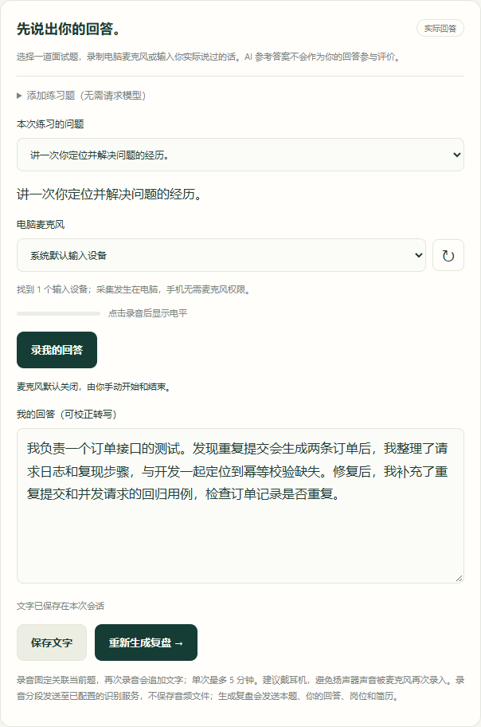
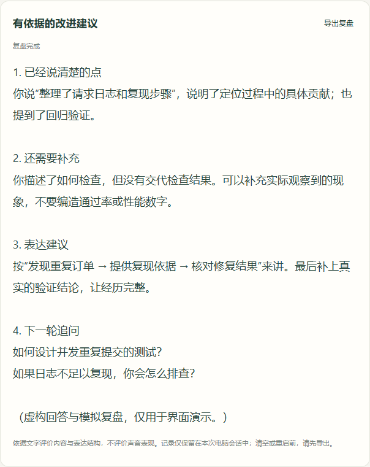

# Tingda — open-source AI mock interview practice

[简体中文](README.md) · **English** · [Download source ZIP](https://github.com/feju0384-star/interview-companion/archive/refs/heads/main.zip) · [Releases](https://github.com/feju0384-star/interview-companion/releases)

Record your own interview answers on a Windows PC, correct the transcript, and get AI feedback based on what you actually said. Use a phone browser as the controller, practice with your target role and résumé, and export a Markdown review with follow-up questions.

The application UI and detailed guide are currently in Chinese. This is a Windows source project with installation scripts, not a standalone EXE installer.

## What it does

- **Mock interview practice:** add a question and provide relevant role and résumé context.
- **Speech-to-text:** explicitly start the PC microphone, finish recording, and correct the transcript. Typed answers also work.
- **Answer review:** identify specific contributions, missing details and expression issues, with two follow-up questions.
- **Export:** save the question, actual answer and review as Markdown.
- **Phone controller:** pair through a QR code on the same local network; no phone app required.
- **Bring your own model:** use local Codex, Claude Code, or a compatible API. Configure speech recognition separately.

| Record and correct an answer | Review and follow-up questions |
| --- | --- |
|  |  |

Screenshots use fictional answers and simulated feedback. They contain no real résumé, recording, account details or API keys.

## Quick start

1. Use a 64-bit Windows 10 / 11 PC and a phone on the same LAN.
2. Download and **extract the entire ZIP**, then double-click **安装并启动听答.cmd**. The script checks Python 3.12 and installs project dependencies; initial setup needs internet access.
3. Run the device/connection diagnostic on the PC and scan the pairing QR code with your phone.
4. Configure your own answer model and speech recognition provider. Open **练习复盘**, add a question, record or type your answer, correct it, and generate a review.

See the [full Chinese guide](docs/使用指南.md) for provider setup, troubleshooting, additional features and development checks.

## Cost and data

The complete local functionality is MIT licensed with no software activation fee. You supply your own provider accounts and pay their usage charges. Optional author setup services are described in the [Chinese README](README.md#免费软件与可选作者服务).

Audio segments go to your configured speech recognition provider. Review requests send the question, answer, role and résumé context to the selected model service. Provider data policies apply. Export your review before clearing the session or restarting the PC service: practice history lives in process memory. Keep the desktop control server on a trusted local network.

AI feedback can be wrong. Use Tingda for mock interviews and permitted practice, and verify transcripts and suggestions yourself.

## Feedback and license

[Report an issue](https://github.com/feju0384-star/interview-companion/issues/new/choose) with your environment, reproduction steps and redacted errors. Never post API keys, pairing links, recordings or private résumé details. Contributions that improve installation, device compatibility and the practice workflow are welcome.

Copyright (c) 2026 刘顺洋. [MIT License](LICENSE); third-party components retain their own licenses. See [THIRD_PARTY.md](THIRD_PARTY.md).
