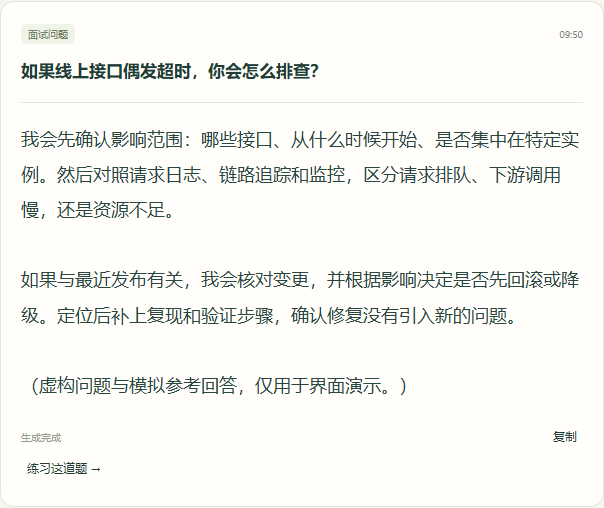
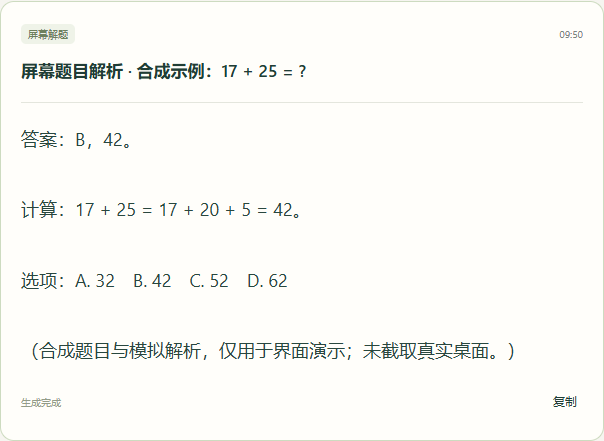

# Tingda — open-source AI interview assistant

[简体中文](README.md) · **English** · [Download source ZIP](https://github.com/feju0384-star/interview-companion/archive/refs/heads/main.zip) · [Releases](https://github.com/feju0384-star/interview-companion/releases)

Transcribe interview questions from Windows system audio, generate reference answers using your target role and résumé, and view and control the workflow from a phone browser. Tingda also analyzes questions in selected screen regions. Recording your own answers, reviewing them and exporting Markdown are additional features.

The application UI and detailed guide are currently in Chinese. This is a Windows source project with installation scripts, not a standalone EXE installer.

## What it does

- **Question transcription:** capture the selected speaker or headphone output, transcribe questions, and correct or enter questions manually.
- **Reference answers:** stream AI responses using role, résumé and question context.
- **Phone controller:** pair through a QR code on the same local network to view answers, select devices, change settings and stop capture; no phone app required.
- **Screen-question analysis:** select a display and question region for an image-capable model. Includes single capture, an optional hotkey and opt-in change monitoring.
- **Bring your own model:** use local Codex, Claude Code, or a compatible API. Configure speech recognition separately.
- **Additional answer review:** explicitly record or type your own answer, correct the transcript, generate feedback and follow-up questions, and export Markdown.

| Interview questions and reference answers | Screen-question analysis |
| --- | --- |
|  |  |

Screenshots use fictional questions, synthetic screen content and simulated responses. They contain no real résumé, recording, desktop capture, account details or API keys.

## Quick start

1. Use a 64-bit Windows 10 / 11 PC and a phone on the same LAN.
2. Download and **extract the entire ZIP**, then double-click **安装并启动听答.cmd**. The script checks Python 3.12 and installs project dependencies; initial setup needs internet access.
3. Run the device/connection diagnostic on the PC and scan the pairing QR code with your phone.
4. Configure your own answer model and speech recognition provider. In **监听设置**, select the speaker/headphone output used by your interview software, start listening, and open **参考回答** to see questions and reference answers. Stop listening before switching to **屏幕解题** for screen-question analysis.

You can enter a question manually before setting up speech recognition. Screen analysis requires an image-capable model. To review your own answer, use the additional **练习复盘** tab and export the review before clearing the session.

See the [full Chinese guide](docs/使用指南.md) for provider setup, troubleshooting, additional features and development checks.

## Cost and data

The complete local functionality is MIT licensed with no software activation fee. You supply your own provider accounts and pay their usage charges. Optional author setup services are described in the [Chinese README](README.md#免费软件与可选作者服务).

Capture starts when you enable it. Audio segments go to your configured speech recognition provider; questions, role and résumé context go to the answer model. Screen analysis sends the selected region to the image-capable model. Review requests additionally include your actual answer. Provider data policies apply. Session history lives in process memory; export reviews before clearing or restarting the service. Keep the desktop control server on a trusted local network.

Transcription, image interpretation, reference answers and feedback can be wrong. Use Tingda in interviews where assistance is permitted, mock interviews and similar settings, and verify the output yourself.

## Feedback and license

[Report an issue](https://github.com/feju0384-star/interview-companion/issues/new/choose) with your environment, reproduction steps and redacted errors. Never post API keys, pairing links, recordings or private résumé details. Contributions that improve installation, device compatibility, transcription, reference answers and screen analysis are welcome.

Copyright (c) 2026 刘顺洋. [MIT License](LICENSE); third-party components retain their own licenses. See [THIRD_PARTY.md](THIRD_PARTY.md).
